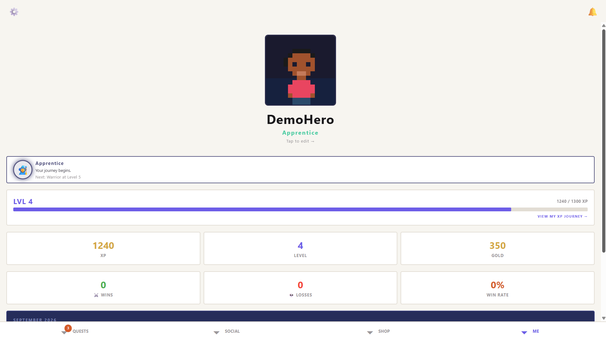
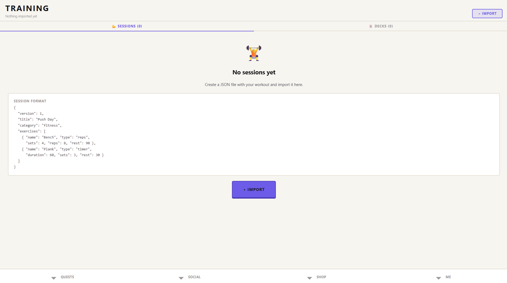
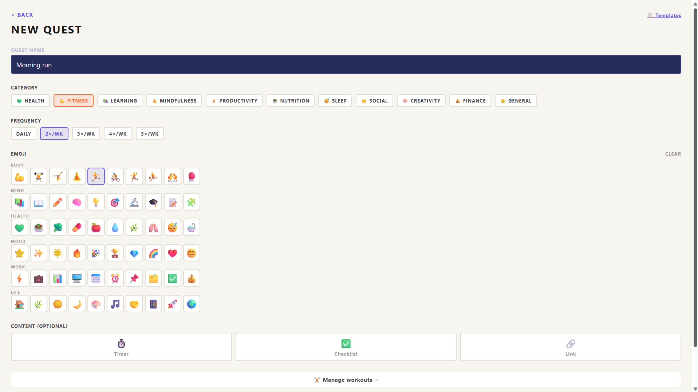

# HabitQuest

> Gamified habit tracker with pixel art aesthetics. Turn discipline into an adventure.


---

## Overview

**HabitQuest** turns your daily habits into an RPG-style adventure. Complete habits, earn XP and Gold, build streaks, and level up. Face other players in **duels**, take on **challenges**, unlock **achievements**, and climb the leaderboards.

Every habit can be personalized with a custom emoji, an assigned category and a target frequency (daily or weekly), and each completion is rewarded with visible progression --- animated XP gains, streak counters, heatmaps, cosmetics.

<p align="center">
  
  
  
</p>


---

## Features

- ✅ Daily and weekly habit tracking with categories and custom emojis
- ✅ **XP** and **Gold** rewards, streaks, cumulative daily XP display
- ✅ Per-habit **monthly heatmap** on the detail screen
- ✅ **Duels** — real-time PvP battles between players (HP bars, sound effects)
- ✅ **Challenges** with progress tracking and Gold rewards on completion
- ✅ **Achievements** system
- ✅ **Social layer** — friends, inbox notifications, friend requests
- ✅ **Leaderboards** (streaks, XP)
- ✅ Statistics — history screen, per-category breakdown, win/loss counts
- ✅ Sound effects and battle music
- ✅ Pull-to-refresh, animations, pixel art aesthetics (Skia)

---

## Tech stack

| Layer | Technology |
|---|---|
| Mobile framework | **React Native** + **Expo SDK 55** (iOS priority) |
| Language | **TypeScript** |
| Rendering | **React Native Skia** (pixel art) |
| Animations | **Reanimated 3** |
| State management | **Legend-State** |
| Backend / Auth / DB | **Supabase** (PostgreSQL + Auth + Realtime) |
| Testing | Jest, Detox (e2e) |

---

## Project structure

```
habitquest/
├── app/                 # Expo Router — routing layer
├── src/                 # Feature modules, UI components, shared libraries
├── assets/              # Fonts, images, audio (SFX + music)
├── supabase/            # Database schema, migrations, RLS policies
├── docs/adr/            # Architecture Decision Records
├── e2e/                 # End-to-end tests (Detox)
├── scripts/
└── README.md
```

---

## Getting started

### Prerequisites

- Node.js **18+**
- npm **9+**
- [Expo Go](https://expo.dev/client) on a physical device (iOS priority) or an iOS simulator
- A [Supabase](https://supabase.com) project (free tier is enough)

### Installation

```bash
# Clone the repository
git clone https://github.com/battisteb/habitquest.git
cd habitquest

# Install dependencies
npm install

# Configure environment
cp .env.example .env
# Fill in your Supabase URL and anon key
```

### Run

```bash
npm start
```

Scan the QR code with **Expo Go** on your device.

---

## Available scripts

| Command | Description |
|---|---|
| `npm start` | Start the Expo dev server |
| `npm test` | Run unit tests (Jest) |
| `npm run lint` | Run ESLint |
| `npm run typecheck` | Run the TypeScript compiler in check mode |
| `npm run e2e` | Run end-to-end tests (Detox) |

---

## Contributing

This is currently a personal side project — pull requests are not being accepted, but issues and suggestions are welcome.

Commits follow [Conventional Commits](https://www.conventionalcommits.org/) :
```
feat(scope): add short description
fix(scope): describe the fix
docs(scope): documentation change
```

---

## Author

Built as a personal project by **Battiste Boungo** — final-year computer engineering student at Polytech Marseille.

- 🌐 [LinkedIn](https://linkedin.com/in/battiste-boungo-793512300)
- 💻 [GitHub](https://github.com/battisteb)

---

## License

Released under the **MIT License** — see [`LICENSE`](LICENSE) for details.
