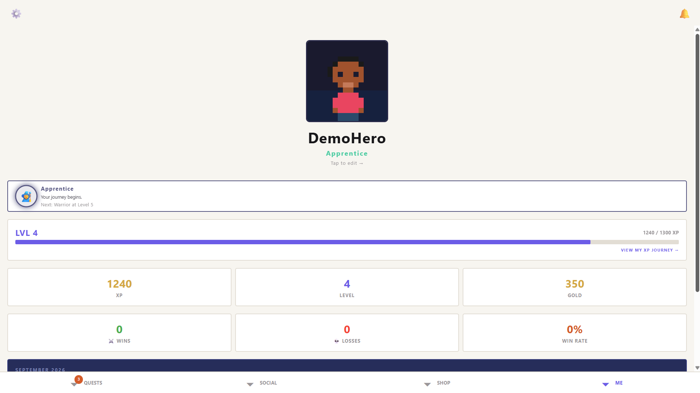
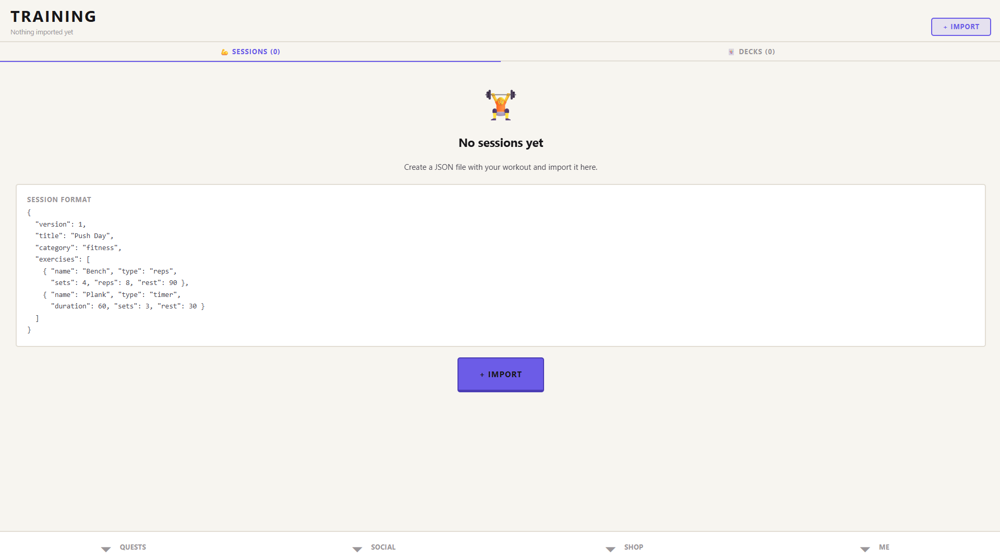
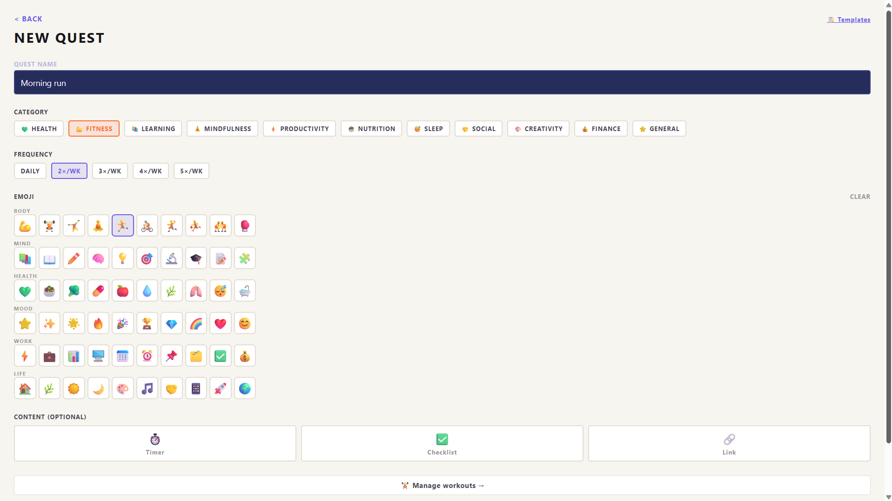

# HabitQuest

> Gamified habit tracker with pixel art aesthetics. Turn discipline into an adventure.


---

## Overview

**HabitQuest** turns your daily habits into an RPG-style adventure. Complete quests, earn XP and Gold, keep your streaks, level up and dress your pixel hero. Challenge friends in **duels** and **1v1 challenges**, team up in **co-op challenges**, climb an **arena league**, unlock **achievements** and finish your **daily missions**. Available in English and French, on iOS, Android and the web.

<p align="center">
  
  
  
</p>


---

## Features

- Daily, weekly and "N times a week" quests with categories, emojis, templates, pause and archive
- XP, Gold, levels and 6 ranks (Novice → Legend), streaks, streak freezes and a single Pause (a day, some quests or everything)
- 32×32 pixel hero with hats, outfits, accessories and themes from the shop
- Daily missions, 23 achievements, weekly recap, stats and heatmaps
- Social: friends, invite links, leaderboards, asynchronous duels, 1v1 challenges with gold stakes, co-op challenges, arena leagues
- Notifications (in-app and push) in the player's language, reminders
- Premium subscription (RevenueCat) and ads for free players (AdMob, not on the web)
- In-app Support, account deletion, guided tutorial
- Server-authoritative economy: XP, gold and results are computed by the database (ADR 008)


---

## Tech stack

| Layer | Technology |
|---|---|
| App | **React Native** + **Expo SDK 55**, Expo Router, **TypeScript** (strict) |
| UI | Pixel art design system (`src/ui`), Reanimated |
| State | **Legend-State** + MMKV |
| Backend | **Supabase**: Postgres with RLS, RPC functions, Edge Functions, Auth (e-mails via Resend) |
| Payments / ads | RevenueCat, Google AdMob |
| Web | Expo web export on EAS Hosting (https://habitquest.expo.app) |
| Testing | Jest + React Native Testing Library, pgTAP (`supabase/tests`), web smoke test (`scripts/smoke-web.js`) |


---

## Project structure

```
habitquest/
├── app/                 # Expo Router routes (thin, re-export feature screens)
├── src/features/        # Feature modules: screens, stores, hooks, utils, tests
├── src/ui/              # Pixel art design system
├── src/lib/             # Supabase client, i18n (FR/EN), storage, game constants
├── supabase/            # Migrations, pgTAP tests, Edge Functions, e-mail templates
├── scripts/             # Smoke test, demo data, sprites, auth e-mails
├── marketing/           # Social media posts and reels (English)
├── docs/                # ADRs, store listings, public site (privacy, terms, support)
└── e2e/flows/           # Maestro flows for device builds (to refresh before release)
```


---

## Getting started

### Prerequisites

- Node.js **18+**
- npm **9+**
- [Expo Go](https://expo.dev/client) on a physical device (iOS priority) or an iOS simulator
- A [Supabase](https://supabase.com) project (free tier is enough)

### Installation

```bash
# Clone the repository
git clone https://github.com/battisteb/habitquest.git
cd habitquest

# Install dependencies
npm install

# Configure environment
cp .env.example .env
# Fill in your Supabase URL and anon key
```

### Run

```bash
npm start
```

Scan the QR code with **Expo Go** on your device.

---

## Available scripts

| Command | Description |
|---|---|
| `npm start` | Start the Expo dev server |
| `npm test` | Unit and component tests (Jest) |
| `npm run lint` / `npm run typecheck` | ESLint / TypeScript check |
| `npx supabase db start && npx supabase test db` | Apply every migration to a fresh database and run the pgTAP tests |
| `npm run check:bundle` | Build the iOS, Android and web bundles |
| `npm run deploy:web` | Export and deploy the web app (EAS Hosting) |


---

## Contributing

This is currently a personal side project — pull requests are not being accepted, but issues and suggestions are welcome.

Commits follow [Conventional Commits](https://www.conventionalcommits.org/) :
```
feat(scope): add short description
fix(scope): describe the fix
docs(scope): documentation change
```

---

## Author

Built as a personal project by **Battiste Boungo** — final-year computer engineering student at Polytech Marseille.

- 🌐 [LinkedIn](https://linkedin.com/in/battiste-boungo-793512300)
- 💻 [GitHub](https://github.com/battisteb)

---

## License

Released under the **MIT License** — see [`LICENSE`](LICENSE) for details.
